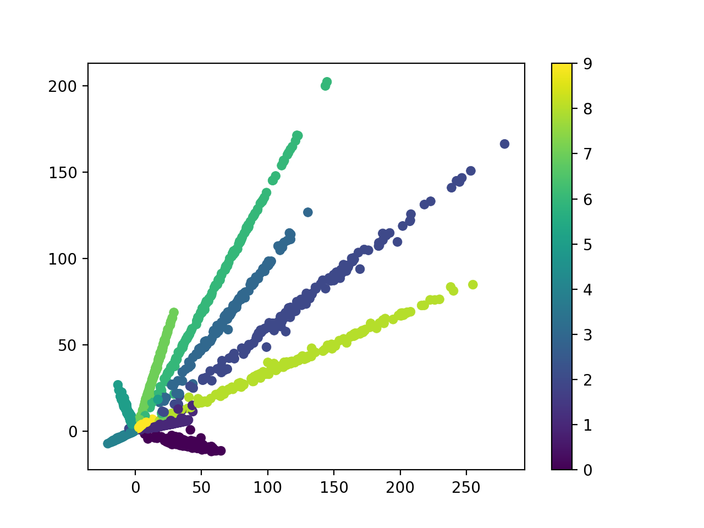
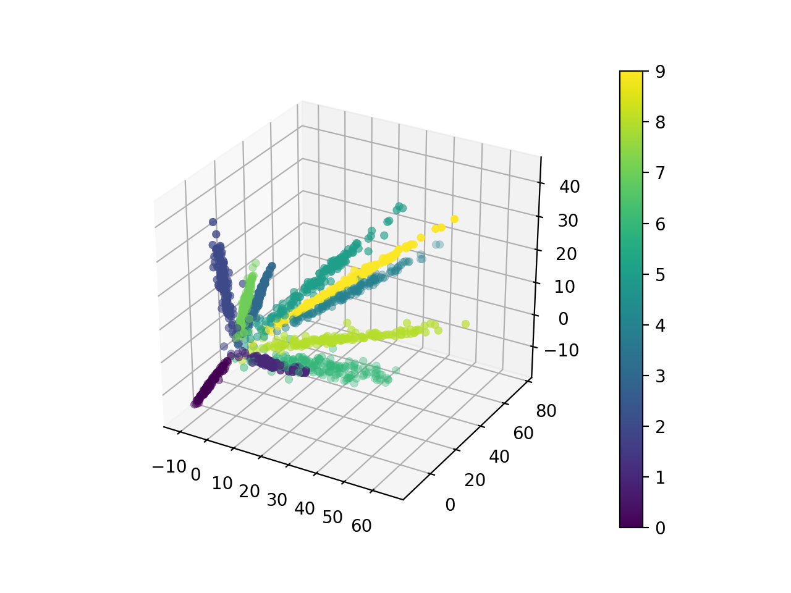
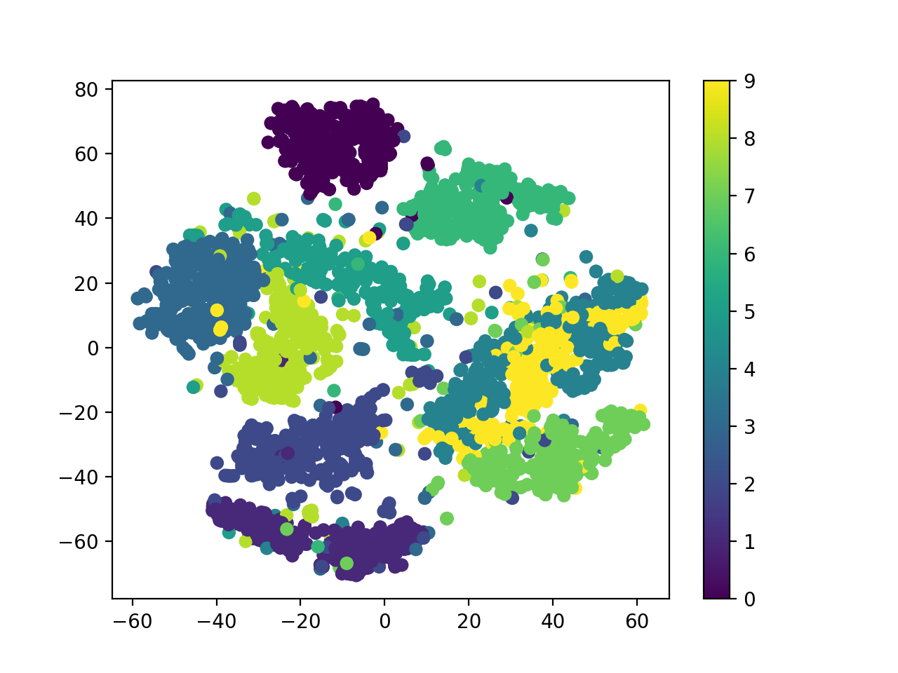

# mnist_3d
- Plot mnist data in 3d space.
- Visualization Method
	- LeNet
	- TruncatedSVD -> T-SNE

# Example

- LeNet_mod(2D)


- LeNet_mod(3D)


- TruncatedSVD -> T-SNE(2D)


- TruncatedSVD -> T-SNE(3D)


# Requirements
python version >= 3.6
```
pip install -r requirements.txt
```

# Run
### (1) Save mnist data as png
```
python save_mnist.py
```

### (2) Plot mnist data
```
python plot.py
```

# Arguments
| Arguments | Default | Example | Description |
|:-----------|:------------|:------------|:----------|
| sample_number | 100 | 1000 | Number of samples extracted from the whole mnist data. |
| phase | train | test | Phase of samples. |
| neural_net | False | N/A | Network to use or not to use |
| mid_dimension | 100 | 500 | Output dimension of TruncatedSVD or LeNet |
| out_dimension | 2 | 3 | Output dimension of t-SNE |
| count_sampled | False | N/A | Count the number of each handwriting nubmers. |

```python
python plot.py -sn 1000 -p test -sd 500 -od 3 -sc
```

# What does it do?
### LeNet
[paper](http://yann.lecun.com/exdb/publis/pdf/lecun-98.pdf)

### Truncated SVD
t-SNE reduces the dimension of the input tensor quite well, but takes a long time when its dimension is high too much. Truncated SVD is recommended to use in that case for speedy processing.

### t-SNE
t-SNE is a tool to visualize high-dimensional data. See [here](https://scikit-learn.org/stable/modules/generated/sklearn.manifold.TSNE.html) for more information.

# Train LeNet by yourself
modifed: https://github.com/pytorch/examples/blob/master/mnist/main.py

```python
python train_lenet.py
```
