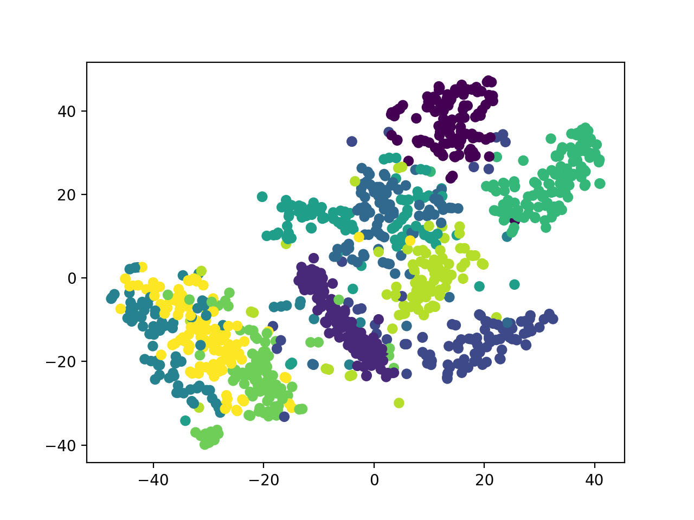
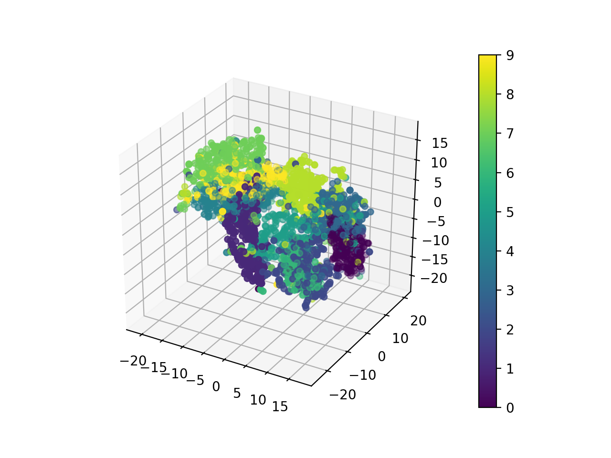

# mnist_3d
- Plot mnist data in 3d space.

# Example




# Requirements
python version >= 3.6
```
pip install -r requirements.txt
```

# Run
### (1) Save mnist data as png
```
python mnist_to_png.py
```

### (2) Plot mnist data
```
python mnist_to_3dplot.py
```

# What does it do?
### Truncated SVD
t-SNE reduces the dimension of the input tensor quite well, but takes a long time when its dimension is high too much. Truncated SVD is recommended to use in that case for speedy processing.
### t-SNE
t-SNE is a tool to visualize high-dimensional data. See [here](https://scikit-learn.org/stable/modules/generated/sklearn.manifold.TSNE.html) for more information.

# Arguments
| Arguments | Default | Example | Description
|:-----------|:------------|:------------|:----------|
| sample_number | 100 | 1000 | Number of samples extracted from the whole mnist data. |
| phase | train | test | Phase of samples. |
| svd_dimension | 100 | 500 | Output dimension of TruncatedSVD |
| out_dimension | 2 | 3 | Output dimension of t-SNE |
| sampled_count | False | (nothing) | Show number of each handwriting nubmers. |

```python
python mnist_to_3dplot.py -sn 1000 -p test -sd 500 -od 3 -sc
```